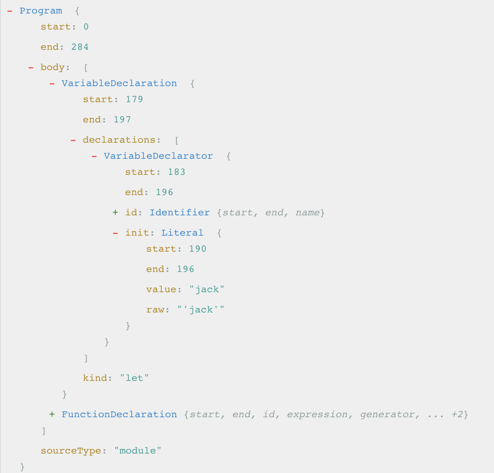
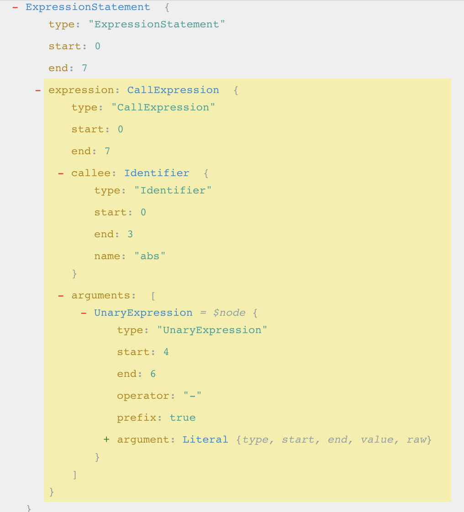

# babel-ast-compiler

note book of ast

## Table of Contents

- [babel简介](#babel-instruct)
- [babel parser](#babel-parser)
- [babel transform](#babel=transform)
- [babel generate](#babel-generate)
- [babel conclusion](#babel-concurrency)

## babel简介

1.基本概念

    babel是一个js编译器(Babel is a JavaScript compiler.)

2.babel运行原理

    用babel对代码进行处理（eg es6转es5或者jsx转换）主要可以划分为3步：parse, transform and generate;

## parse

1. parse的主要工作
    使用解析器（parser）对输入的源代码字符串进行解析并生成初始 AST（File.prototype.parse），可以使用babel-traverse对AST进行遍历，并解析出整个树的path，通过挂载的 metadataVisitor 读取对应的元信息；

2. 关于ast
   对于开发者来说，源码可读性更高，但是站在计算机的角度，ast更易于计算机的处理，所有的ast根节点都是Program节点;ast各种节点信息对于我们编写babel插件来说必不可少，关于各种节点类型信息的详细说明见：[core Babylon AST node types](https://github.com/babel/babylon/blob/master/ast/spec.md)

    对与下面一段简单的js代码片段:

```javascript
    let name = 'jack';
    function printTips() {
        tips.forEach((tip, i) => console.log(`Tip ${i}:` + tip));
    }
```

    转换成ast树的结构为：

    

## transform

1 transform的用法
    遍历AST树并应用各transformers（plugin)生成变换后的AST树, babel中最核心的是babel-core，它向外暴露出babel.transform 接口。

```javascript
    babelCore.transform(output, {
        plugins: [
            require("babel-plugin-transform-object-rest-spread"),
            unEscapeJsescPlugin
        ],
        babelrc: false
    }).code
```

2 编写一个babel plugins

2.1 遍历ast tree的节点

    在编写ast插件的时候，通常需要遍历ast tree的节点，babel提供了babel-traverse来对树状结构进行遍历；对于ast tree上的每一个分支我们都会先向下遍历走到尽头，然后向上遍历退出遍历过的节点寻找下一个分支;

(1) visitor对象

    Babel提供我们一个visitor对象供我们获取ast tree里具体节点来进行访问;eg.比如我们想访问if else语句生成的节点，我们可以在visitor里指定获取它所对应的节点：其实这种遍历会让每个节点都会被访问两次，一次是向下遍历代表进入（enter），一次是向上退出（exit）。因此实际上每个节点都会有 enter和exit方法;

```javascirpt  
    const visitor = {
        IfStatement() {
            enter() {
                console.log("enter if sentence");
            },
            exit() {}
        }
    };
```  

(2) path

    visitor模式中我们对节点的访问实际上是对节点路径的访问，在这个模式中我们一般把path当作参数传入节点选择器中。path表示两个节点之间的连接，通过这个对象我们可以访问到节点、父节点以及进行一系列跟节点操作相关的方法（类似 DOM 的操作）。

```javascript
    var babel = require('babel-core');
    var t = require('babel-types');

    const code = `d = a + b + c`;
    const visitor = {
        Identifier(path) {
            console.log(path.node.name);  // d a b c
        }
    };
    const result = babel.transform(code, {
        plugins: [{
            visitor: visitor
        }]
    });
```

(3) 节点替换

    编写一个简单的Babel插件。把下面的abs函数换成原生支持的Math.abs来进行调用；

```javascript
    function abs(number) {
        if (number >= 0) {  
            return number;  
        } else {
            return -number;
        }
    }
```

    可以先通过（在线ast转换平台）[https://astexplorer.net/]查看一下abs(-8)对应的ast tree的结构，如下所示：
    
    

    可以看到表达式语句下面的 expression 主要是函数调用表达式（CallExpression），因此我们也需要创建一个函数调用表达式,可以借助 babel-types 里提供的一些方法帮我们快速创建。

```javascript
    // 创建函数调用表达式
    t.CallExpression(
    // 创建对象属性引用
        t.MemberExpression(t.identifier('Math'), t.identifier('abs')),
        // 原始节点函数调用参数
        path.node.arguments
    )
```

```javascript
    var babel = require('babel-core');
    var t = require('babel-types');

    const code = `abs(-8);`;
    const visitor = {
        CallExpression(path) { //函数调用
            if (path.node.callee.name !== 'abs') return; //函数名不为abs，不处理；
            console.log("path==========>", path);
            path.replaceWith(t.CallExpression( //使用babel-types创建CallExpression类型节点，并替换已有节点；
                t.MemberExpression(t.identifier('Math'), t.identifier('abs')),
                path.node.arguments
            ));
        }
    };
    const result = babel.transform(code, {
        plugins: [{
            visitor: visitor
        }]
    });
    // Math.abs(-8)
    console.log("result.code====>", result.code);
```

## generate

    利用babel-generator将AST树输出为转码后的代码字符串;

```javascript
    const generator = require('babel-generator').default;
    code = generator(code).code;
```


https://babeljs.io/docs/en/next/babel-types.html